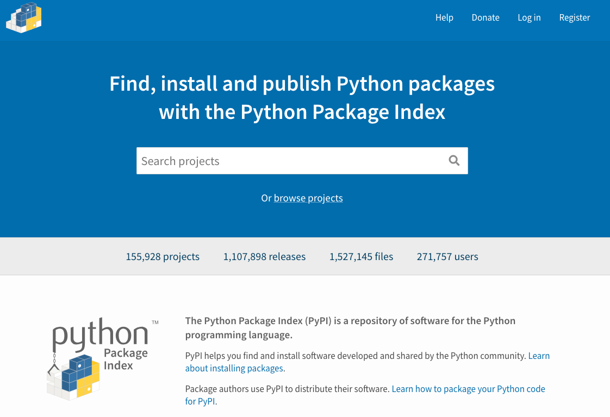

# Instalando librerías en Python

A parte de las librerías con las que ya viene python, como 're', 'math' o 'csv', podemos vitaminar nuestra instalación con muchas otras que nos ofrecen funcionalidades extra de manera libre y gratuita.

Sólo tendremos que correr el comando 'pip install <nombre de la lirería>' y luego importarla en nuestro script.

```bash
pip install requests
```

Una vez hecho esto, deberemos incluirla en las primeras líneas del archivo '.py' en el que queramos utilizarla siguiendo las instrucciones de la página del proyecto.

```python
import requests
from bs4 import BeautifulSoup # Importamos sólo un paquete de esa librería
```

Todos estas librerías se descargarán de la web [https://pypi.org/](https://pypi.org/)

Puedes buscar muchas librerías en ella:


